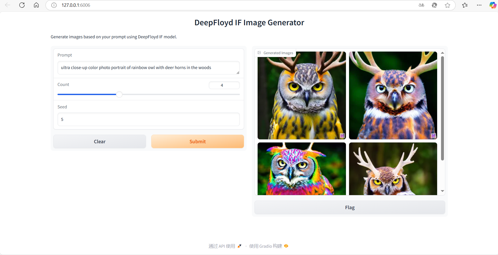
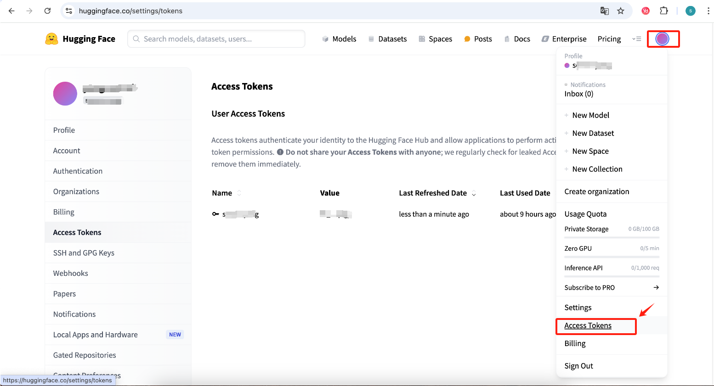

# 非常感谢Deepfloyd的团队开源了IF模型，IF-easy-webui是基于IF模型的一个简单易用的webui，主要解决了IF在依赖包安装、模型下载后找不到文件加载、inpainting类型转换错误等问题，方便大家快速体验IF模型

# 使用指引
## 1.下载源代码
```bash 
root@xxxx:~# git clone https://github.com/amazed6666/IF-easy-webui.git
```

## 2.进入到IF-easy-webui目录下，执行依赖包安装：pip install -r requirements.txt
```bash 
root@xxxx:~# cd IF-easy-webui
root@xxxx:~/IF-easy-webui# pip install -r requirements.txt
```

## 3.安装clip
```bash 
root@xxxx:~/IF-easy-webui# pip install git+https://github.com/openai/CLIP.git --no-deps
```

## 4.使用huggingface的Access Token登录huggingface_hub
```bash 
root@xxxx:~/IF-easy-webui# git config --global credential.helper store
root@xxxx:~/IF-easy-webui# python
Python 3.8.10 (default, Jun  4 2021, 15:09:15) 
[GCC 7.5.0] :: Anaconda, Inc. on linux
Type "help", "copyright", "credits" or "license" for more information.
>>> from huggingface_hub import login
>>> 
>>> login()

    _|    _|  _|    _|    _|_|_|    _|_|_|  _|_|_|  _|      _|    _|_|_|      _|_|_|_|    _|_|      _|_|_|  _|_|_|_|
    _|    _|  _|    _|  _|        _|          _|    _|_|    _|  _|            _|        _|    _|  _|        _|
    _|_|_|_|  _|    _|  _|  _|_|  _|  _|_|    _|    _|  _|  _|  _|  _|_|      _|_|_|    _|_|_|_|  _|        _|_|_|
    _|    _|  _|    _|  _|    _|  _|    _|    _|    _|    _|_|  _|    _|      _|        _|    _|  _|        _|
    _|    _|    _|_|      _|_|_|    _|_|_|  _|_|_|  _|      _|    _|_|_|      _|        _|    _|    _|_|_|  _|_|_|_|

Enter your token (input will not be visible): 
Add token as git credential? (Y/n) Y
>>> exit()
```

## 5.运行webui.py后，需要等待一段时间，加载模型文件完成后，会显示如下信息；然后可以打开浏览器，输入http://127.0.0.1:6006，即可看到IF-easy-webui的界面，可以开始体验IF模型了
```bash 
root@xxxx:~/IF-easy-webui# python webui.py
FORCE_MEM_EFFICIENT_ATTN= 0 @UNET:QKVATTENTION
/root/miniconda3/lib/python3.8/site-packages/huggingface_hub/file_download.py:791: FutureWarning: The `force_filename` parameter is deprecated as a new caching system, which keeps the filenames as they are on the Hub, is now in place.
  warnings.warn(
Loading pipeline components...: 100%|████████████████████████████████████████████████████████████████████████████████████████████████████████| 6/6 [00:00<00:00,  8.59it/s]
Loading checkpoint shards: 100%|█████████████████████████████████████████████████████████████████████████████████████████████████████████████| 2/2 [00:19<00:00,  9.86s/it]
Running on local URL:  http://127.0.0.1:6006

To create a public link, set `share=True` in `launch()`.
``` 


## 6.温馨提示：怎么获取huggingface的Access Token，首先登录https://huggingface.co，然后再点击右上角我的头像，在显示的拉下菜单中找到Access Token，点击进入该页面可以生成huggingface_hub登录所需要的Access Token（参照截图）


