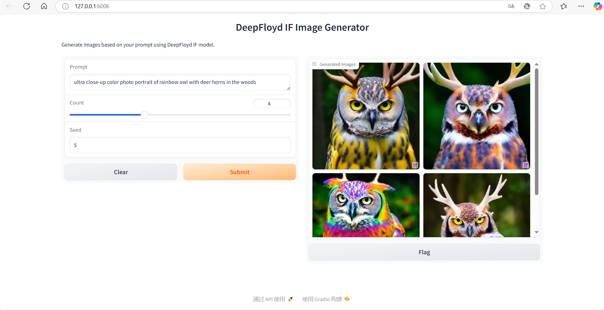

## Thanks to the Deepfloyd team for open-sourcing the IF model. IF-easy-webui is a simple and user-friendly web interface based on the IF model.
## which primarily addresses issues such as dependency package installation error, missing model files after download, and errors in converting inpainting types. 
## This makes it easier for everyone to quickly experience the IF model.

## click here to view chinese readme[README-chinese.md](README-chinese.md)

# User Guide
## 1.Download the Source Code
```bash 
root@xxxx:~# git clone https://github.com/amazed6666/IF-easy-webui.git
```

## 2.Navigate to the IF-easy-webui directory and install the required dependencies
```bash 
root@xxxx:~# cd IF-easy-webui
root@xxxx:~/IF-easy-webui# pip install -r requirements.txt
```

## 3.Install clip：
```bash 
root@xxxx:~/IF-easy-webui# pip install git+https://github.com/openai/CLIP.git --no-deps
```

## 4.Log in to huggingface_hub Using an Access Token,Configure Git to store credentials and log in using Python:
```bash 
root@xxxx:~/IF-easy-webui# git config --global credential.helper store
root@xxxx:~/IF-easy-webui# python
Python 3.8.10 (default, Jun  4 2021, 15:09:15) 
[GCC 7.5.0] :: Anaconda, Inc. on linux
Type "help", "copyright", "credits" or "license" for more information.
>>> from huggingface_hub import login
>>> 
>>> login()

    _|    _|  _|    _|    _|_|_|    _|_|_|  _|_|_|  _|      _|    _|_|_|      _|_|_|_|    _|_|      _|_|_|  _|_|_|_|
    _|    _|  _|    _|  _|        _|          _|    _|_|    _|  _|            _|        _|    _|  _|        _|
    _|_|_|_|  _|    _|  _|  _|_|  _|  _|_|    _|    _|  _|  _|  _|  _|_|      _|_|_|    _|_|_|_|  _|        _|_|_|
    _|    _|  _|    _|  _|    _|  _|    _|    _|    _|    _|_|  _|    _|      _|        _|    _|  _|        _|
    _|    _|    _|_|      _|_|_|    _|_|_|  _|_|_|  _|      _|    _|_|_|      _|        _|    _|    _|_|_|  _|_|_|_|

Enter your token (input will not be visible): 
Add token as git credential? (Y/n) Y
>>> exit()
```

## 5.After running webui.py, you will need to wait for some time while the model files are being loaded. Once the loading is complete, the following message will be displayed. Then, you can open your browser and enter http://127.0.0.1:6006 to access the IF-easy-webui interface and start experiencing the IF model
```bash 
root@xxxx:~/IF-easy-webui# python webui.py
FORCE_MEM_EFFICIENT_ATTN= 0 @UNET:QKVATTENTION
/root/miniconda3/lib/python3.8/site-packages/huggingface_hub/file_download.py:791: FutureWarning: The `force_filename` parameter is deprecated as a new caching system, which keeps the filenames as they are on the Hub, is now in place.
  warnings.warn(
Loading pipeline components...: 100%|████████████████████████████████████████████████████████████████████████████████████████████████████████| 6/6 [00:00<00:00,  8.59it/s]
Loading checkpoint shards: 100%|█████████████████████████████████████████████████████████████████████████████████████████████████████████████| 2/2 [00:19<00:00,  9.86s/it]
Running on local URL:  http://127.0.0.1:6006

To create a public link, set `share=True` in `launch()`.
``` 


## 6.Friendly Reminder: How to Obtain a Hugging Face Access Token
To get a Hugging Face Access Token, follow these steps:

Log in to Hugging Face at https://huggingface.co/

Click on your profile picture in the top-right corner.

From the dropdown menu, select Access Tokens.

On the Access Tokens page, you can generate the token required for logging into huggingface_hub (refer to the screenshot).


## click here to view Deepfloyd's README [README-deepfloyd.md](README-deepfloyd.md)

